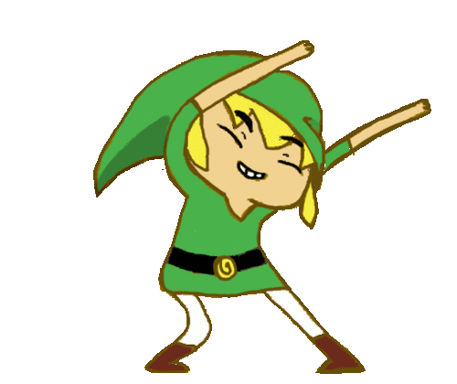

#  Hello World! I'm Renato.

##  About me

- I'm <b>Renato</b> 🙇🏻‍♂️
- 26yo ⌛
- Brazilian 🇧🇷
- From Santo Amaro/Ba 📍
- Computer graduate ✔️
- Web Technology lover ❤️‍🔥
- Extremely Curious 🤔
- I'm a <b>Full Stack Web</b> Developer under construction 🚧

##  Technologies

- Currently learning <b>React</b> 👨‍💻;
 - ✍️ : 

 
 Languages/Frameworks | Habilities/Content
------------ | --------------
 | Structure • Text • Fonts • Lists • Links • Images • Tables • Forms
 | Text • Color • Flex-box • Lists • Tables • Forms • Using Internal/External • Inheritance • Selectors
 | Syntax • Variables • @Mixins • @Include • @Use
 | Components • useState • useEffect • Routes • useContext
 
 
 

 
  
 
 

 
##  Studying

 ##  Interests
 
 - <strike>Full-time</strike> Part-time gamer 🎮 
 - Gaming Plataforms:   
 
 
 
 
 
 ### Play With Me
 
 -  Gamertag: Tinhobas
 -  Nickname: Tinhobas
 -  Friend Code: SW-1251-1911-1634

 
 ##  Contact me
 
 
 
 
 
