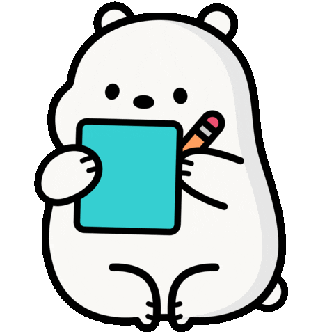

#  Hello World! I'm Renato.

##  About me

- I'm <b>Renato</b> 🙇🏻‍♂️ • 26yo ⌛
- Brazilian 🇧🇷 • From Santo Amaro/Ba 📍
- Computer graduate ✔️
- Web Technology lover ❤️‍🔥
- Extremely Curious 🤔
- I'm a <b>Full Stack Web Developer</b> under construction 🚧

##  Technologies

 

 
See the details!

 

 
 

 
   Front-End Technologies
------------ 
 
 Languages/Frameworks | Habilities/Content
------------ | --------------
 | Structure • Text • Fonts • Lists • Links • Images • Tables • Forms
 | Text • Color • Flex-box • Lists • Tables • Forms • Using Internal/External • Inheritance • Selectors
 | Syntax • Variables • @Mixins • @Include • @Use
 | Functions • DOM Manipulation • Selectors • Events • JSON • LocalStorage • Class • Closure • Polymorphism • Arrow Functions • Module • Promises • Async/Await • Spread/Rest • Array Functions • API
 | Components • Props • PropTypes • Controlled Components • useState • useEffect • Routes • useContext • Styled Components 💅
 
 
 

 
  Back-End Technologies
------------ 
 Languages/Frameworks | Habilities/Content
------------ | --------------
 | Class • Objects • Methods • Attributes • Modifiers • Closure • Polymorphism • Constructors • Interfaces • Linq • Try/Catch
  | DDL Commands
 
  

##  Learning

- Currently learning <b>.NET</b> 👨‍💻

Languages/Frameworks | Content
------------ | --------------
  | Web API

 

 ##  Interests
 
 
 
 - <strike>Full-time</strike> Part-time gamer 🎮
 - Gaming Plataforms:   
 
 
  
 
 
 ### Play With Me
 
 -  Gamertag: Tinhobas
 -  Nickname: Tinhobas
 -  Friend Code: SW-1251-1911-1634

 
 ##  Contact me
 
 
 
 
 
